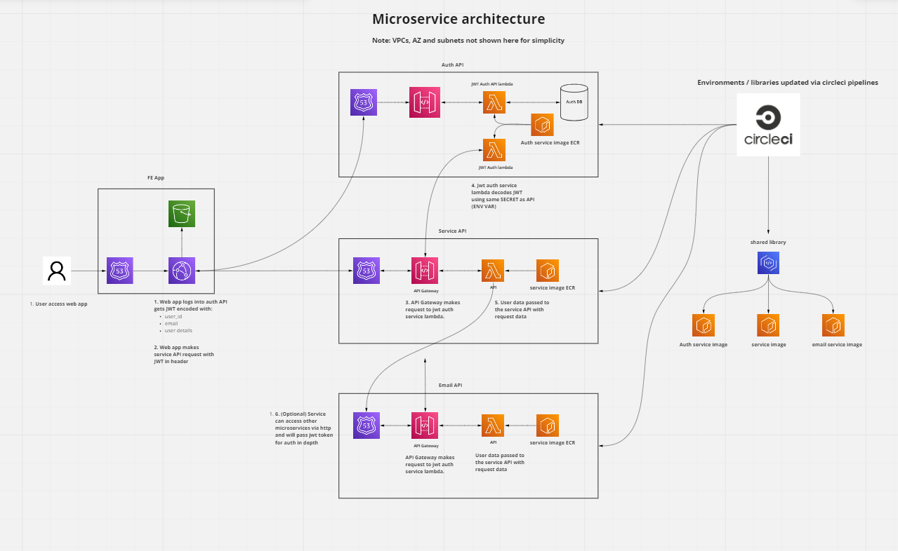

# Registry

A project to act as a generic persistence layer with the following abilities.

- Can define entity types with fields
- CRUD entities
- Link entities to one anther
- Search entities by type, fields uuids or links

## Endpoints

POST/ GET/ PATCH/ DELETE /entityType/
POST/ GET/ /entity/<type>/<uuid>/
GET/ PATCH/ DELETE /entity/<type>/<uuid>/
GET/ /entity/<type>/search/?fields=address="test address"&links=<uuid>&limit=#
POST /entity/<type>/upload

## Design

## TODO

- Deploy project (lambda + dynamodb)
- Setup back linking uuid in linked entity (update both entities) (use web framework after request callback logic)
- Add multiple owners for entities (users, groups and organisations)
- Filter by organisation (add default org for anonymous users)
- Add search endpoint using nosql
    - Search by field / links
- Add bulk download endpoint
- Add updating field names logic (might need uuid to identify fields to update)
- Add tags / categories for entity types
- Setup entity data migration logic for update entity type
    - fastapi background task
- Design search indexing / better data migration logic (event bus? celery?)
- Add elasticsearch to dockercompose
- Upgrade search endpoint with elasticsearch
- Add Auth (decode /jwt token)

# Requirements

This project requires installed on your OS.

- docker and docker-compose
- makefile command
- terraform (version 1.1.1)

# Running locally

To start the project run the command:

`make run`

This will build a lambda compatible docker container running fast api that can be accessed via:

`http://localhost:8888`

# Deploying to AWS

Here is a diagram showing how this projects looks in AWS.

Deployment is done when we merge a branch into main on github and the following is orchestrated through the .circleci/config.yml. Before the pipeline will work we require some inital pipeline setup.

Before running any of the below add AWS credentials via terraform ENV Vars:

export TF_VAR_aws_access_key=""
export TF_VAR_aws_secret_key=""

These will also need to be added to our circleci pipeline for the automated pipeline to work correctly.

### Create pipeline

First we need to create infra for pipeline and to push a docker image this is done: 

`AWS_DEFAULT_REGION=eu-west-1 environment=staging make init_pipeline`
`AWS_DEFAULT_REGION=eu-west-1 environment=staging make apply_pipeline`

This is will create our ECR repo we need to push an image to, the automated pipeline should work from this point on.

## Build image

From the root repo directory run:

`AWS_DEFAULT_REGION=eu-west-1 environment=staging make build push`

This will build an image, tag it and push it to the ECR repository. This will use the aws credentials created by aws CLI stored in ~/.aws/credentials. 

## Deploying image

Get the docker tag from the previous build push command, then inside infra/ folder run:

`AWS_DEFAULT_REGION=eu-west-1 environment=staging make init`
`AWS_DEFAULT_REGION=eu-west-1 environment=staging docker_tag=<docker_tag> make plan`
`AWS_DEFAULT_REGION=eu-west-1 environment=staging docker_tag=<docker_tag> make apply`

This will prepare and build a staging environment for this project, to destroy the environment run:

`AWS_DEFAULT_REGION=eu-west-1 environment=staging make destroy`

To create a different environment run:

`AWS_DEFAULT_REGION=eu-west-1 environment=test make init`
`AWS_DEFAULT_REGION=eu-west-1 environment=test docker_tag=<docker_tag> make plan`
`AWS_DEFAULT_REGION=eu-west-1 environment=test docker_tag=<docker_tag> make apply`

# Domain Driven Development

The structure of this project is based on a DDD programming technique "Hexagonal architecture" as described here:
https://medium.com/ssense-tech/hexagonal-architecture-there-are-always-two-sides-to-every-story-bc0780ed7d9c

The goal is to avoid coupling logic so that it can be re-used across projects.

